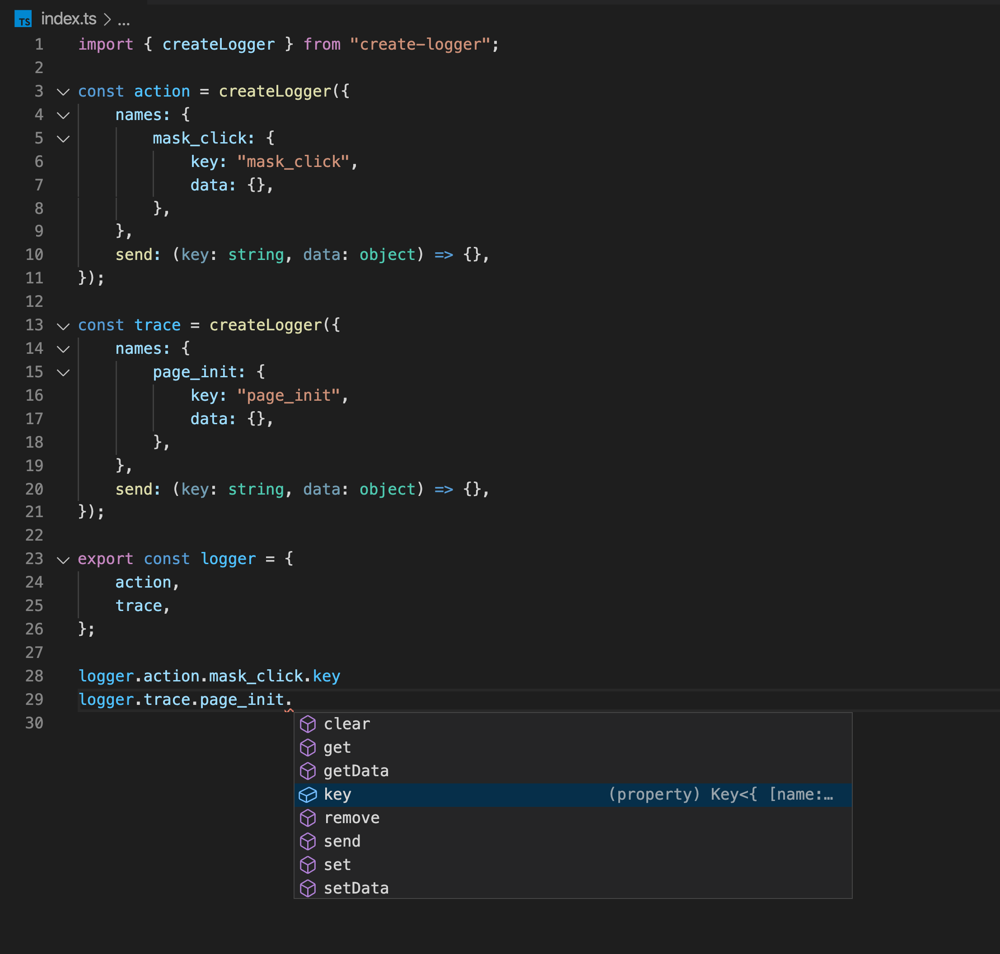

# create-logger

快捷埋点工具

## 为什么要使用

为了统一，之前项目中可能在发送埋点的时候使用了常量，或是字符串的形式作为埋点的键，可能还有拼接的字符串，造成项目里埋点的混乱。另外一个问题就是产品方有时需要的埋点数据不是一次性产生的，（比如：弹窗打开的时间）。这样就要在文件中声明额外的变量来获得这个时间。而这种变量跟我们项目的整体逻辑没有关系，使用这个工具可以防止这种事情的发生。

## 安装 create-logger

```
npm install create-logger --save
```

## 在项目中使用

create-logger 项目只导出一个方法就是 createLogger，通过该方法可以创建出具有提示效果的发送埋点的实例。



## 属性

---

### **key**

返回的是配置的 key，一个 string 类型的数据，如果没有配置 key，将会返回 string 形式的字段名。（logger.['string'] 将会返回"string"）。最终发送的埋点是这个值。

## 方法

---

### **set(field: string | number, value: string | boolean | number)**

logger['string'] 下有一个内置的属性 data，是在 logger['string'] 属性下面的对象，set 方法可以设置这个对象的内容，最后通过 send 方法发送这个内置对象，由于我们可以多次调用 set 方法，可以设置开始时间，结束时间，并获取中间的时间差。最后在需要的时机发送。当调用 send 之后这个对象将被清空。

### **get(field: string | number)**

获取内置 data 的某个属性值

### **remove(field: string | number)**

删除 data 的某个属性

### **setData(data: { [name: string]: string | boolean | number })**

从新设置整个 data

### **getData()**

获取整个 data

### **clear()**

清空 data 的属性

### **send(data?: { [name: string]: string | boolean | number })**

调用传入的 send 方法。并清空 data。或者直接一次性传入 data 并发送
