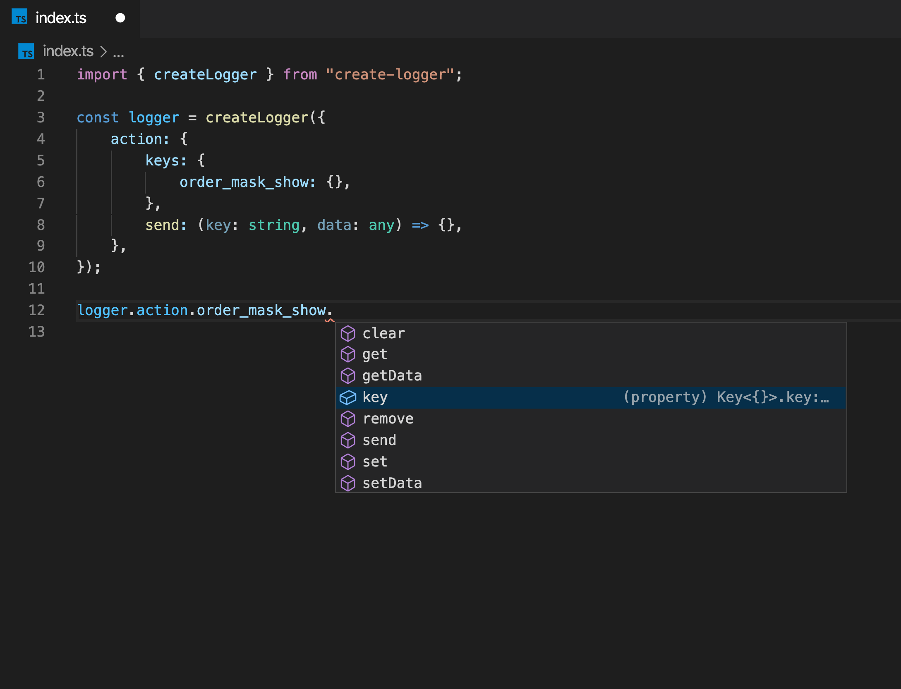

# 1. create-logger

快捷埋点工具

-   [1. create-logger](#1-create-logger)
    -   [1.1. 为什么要使用](#11-为什么要使用)
    -   [1.2. 安装 create-logger](#12-安装-create-logger)
    -   [1.3. 在项目中使用](#13-在项目中使用)
        -   [1.3.1. 创建一个 logger](#131-创建一个-logger)
        -   [1.3.2. 使用 logger](#132-使用-logger)
            -   [1.3.2.1. key](#1321-key)
            -   [1.3.2.2. set](#1322-set)
            -   [1.3.2.3. get([field: string])](#1323-getfield-string)
            -   [1.3.2.4. remove()](#1324-remove)
            -   [1.3.2.5. setData([data])](#1325-setdatadata)
            -   [1.3.2.6. getData()](#1326-getdata)
            -   [1.3.2.7. clear()](#1327-clear)
            -   [1.3.2.8. send([?:data])](#1328-senddata)

## 1.1. 为什么要使用

为了统一，之前项目中可能在发送埋点的时候使用了常量，或是字符串的形式作为埋点的键，可能还有拼接的字符串，造成项目里埋点的混乱。另外一个问题就是产品方有时需要的埋点数据不是一次性产生的，（比如：弹窗打开的时间）。这样就要在文件中声明额外的变量来获得这个时间。而这种变量跟我们项目的整体逻辑没有关系，使用这个工具可以防止这种事情的发生。

## 1.2. 安装 create-logger

```
npm install create-logger --save
```

## 1.3. 在项目中使用

### 1.3.1. 创建一个 logger

```ts
import { createLogger } from 'create-logger'

export const logger = createLogger({
	action: {
		action: {
			names: {
				order_mask_show: {
					// 这里可以使用别的字段作为 “order_mask_show” 的别名
					key: 'order_mask_show', // 真正发送的埋点键
					data: {
						field_string: '',
						field_boolean: false,
						field_number: 0,
					},
				},
			},
			send: (key: string, data: object) => {
				// TODO: 使用传入的数据统一发送埋点
			},
		},
		trace: {
			names: {
				order_mask_hide: {
					key: 'order_mask_hide',
					data: {
						field_string: '',
						field_boolean: false,
						field_number: 0,
					},
				},
			},
			send: (key: string, data: object) => {},
		},
	},
})
```

create-logger 项目只导出一个方法就是 createLogger，通过该方法可以创建出具有提示效果的发送埋点的实例。createLogger 的参数是一个对象，其中 action、trace 是可选的参数，但是如果传入这个参数，那么 action 的结构必须按照声明文件所期望的那样，否则不会生效

### 1.3.2. 使用 logger



#### 1.3.2.1. key

返回的是 "order_mask_show"，一个 string 类型的数据，返回的是配置里面 key 下面的数据。

#### 1.3.2.2. set

logger.action,order_mask_show 下有一个内置的属性 data，就是在 createLogger 中 order_mask_show 属性下面的对象，在 order_mask_show 下面还有 set 方法，可以设置这个对象的内容，最后我们可以通过 send 方法，将我们配置好的对象发送出去，由于我们可以多次调用 set 方法，可以设置开始时间，结束时间，并获取中间的时间差。最后在需要的时机发送。

#### 1.3.2.3. get([field: string])

获取 data 的某个属性

#### 1.3.2.4. remove()

删除 data 的某个属性

#### 1.3.2.5. setData([data])

从新设置整个 data

#### 1.3.2.6. getData()

获取整个 data

#### 1.3.2.7. clear()

清空 data 的属性

#### 1.3.2.8. send([?:data])

调用传入的 send 方法。并清空 data。或者直接一次性传入 data 并发送
